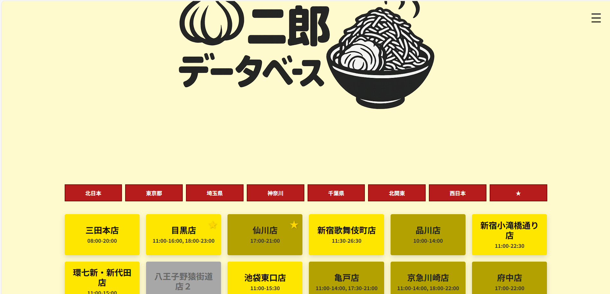
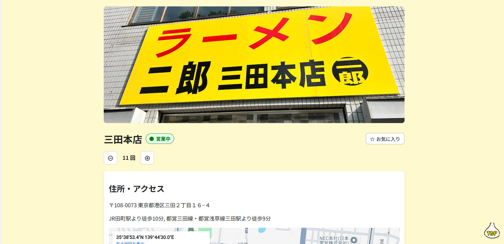
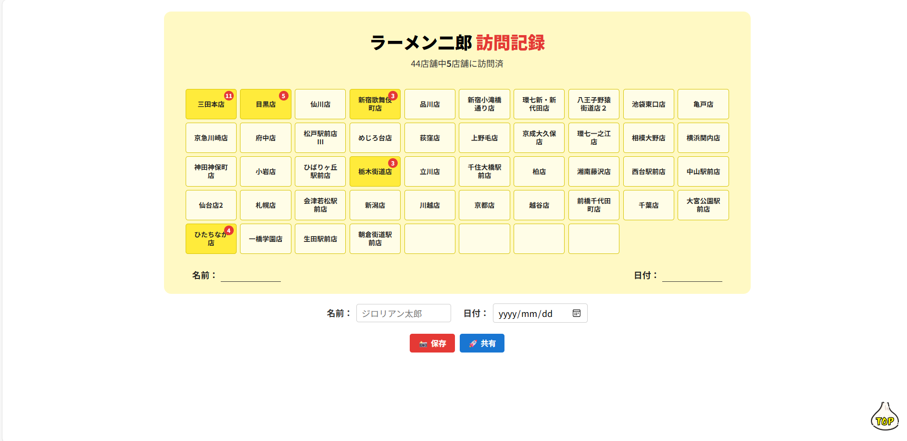

# 🍜 ラーメン二郎データベース  
**Ramen Jiro Database – React × Vite Project**

Webフロントエンド開発の実践力を磨くために制作した、  
ラーメン二郎全店舗をデータベース化した体験共有アプリです。

---

## 🎯 Project Overview

本プロジェクトは、**React（Vite環境）を用いたSPA構築・UI設計・データ管理の実践**を目的に開発しました。  
「ラーメン二郎」という明確なテーマを題材に、**JSONデータの構造化・状態管理・LocalStorageの活用・画面設計**を体系的に学習・実装しています。

---

## 🧩 Features

| 機能 | 内容 |
|------|------|
| 🏠 **トップページ（Home）** | 全44店舗をカード形式で一覧表示。営業時間データをもとに「営業中／休憩中／定休日」を自動判定。地域別フィルタ・お気に入り機能を搭載。 |
| 🏅 **スタンプラリー（Stamp Rally）** | 訪問店舗を記録し、オリジナルのジロリアンカードを自動生成。名前・日付入力やSNS共有（html2canvas）対応。 |
| ⭐ **お気に入り管理** | 各店舗をお気に入り登録し、フィルタで絞り込み可能。LocalStorageによる永続化を実装。 |
| 📱 **レスポンシブ対応** | PC・スマートフォン両対応。店舗カードやスタンプカードは自動スケーリング。 |
| ☰ **ナビゲーション** | ハンバーガーメニューでページ遷移（Home／Stamp／Search／Contact）。 |

---

## 🖥️ UI Screenshots

| ホーム画面 | スタンプラリー画面 |
|-------------|----------------|
|  |  |

※スマートフォンレイアウトにも対応済み

---

## ⚙️ Tech Stack

| 分類 | 使用技術 |
|------|----------|
| フレームワーク | React（Vite） |
| 言語 | JavaScript / JSX / HTML / CSS |
| 状態管理 | useState / useEffect（React Hooks） |
| データ管理 | localStorage |
| 外部ライブラリ | html2canvas |
| デザインフォント | UD デジタル 教科書体 NK |
| 環境 | Node.js / npm / GitHub Pages（公開予定） |

---

## 🧭 今後の拡張予定（Roadmap）

### ✍️ 訪問記録機能（My Record）
ユーザーが自身の訪問体験を記録できる仕組みを開発予定。  
**記録内容：**
- 訪問日（年月日）  
- 店舗名  
- 注文メニュー  
- コール内容（例：ニンニクマシアブラカラメ）  
- 感想メモ  
- 写真（最大4枚まで添付）  

**技術的ポイント：**
- LocalStorageまたはIndexedDBで保存  
- JSONデータで構造化  
- レコード一覧表示／削除／編集機能  
- サムネイル付きカードUI設計  

### ☁️ SNS連携拡張
- X（Twitter）投稿テンプレート自動生成  
- スタンプ画像＋ハッシュタグ付き共有機能  

### 🔔 Firebase通知（構想段階）
- 店舗ごとの臨時休業情報のプッシュ通知連携  

---

## 🧠 Development Highlights

- **状態管理の最適化**：全店舗データをJSONで構造化し、`useEffect`で動的にLocalStorageと同期。  
- **再利用可能なコンポーネント設計**：`StoreCard`, `StampCard`などを単一責務で設計。  
- **UI設計のこだわり**：ラーメン二郎らしい“黄色×赤”を基調にしつつ、モダンで明るい配色。  
- **デザインスケーリング**：スマホでは`transform: scale()`を使用し、比率を保ったまま縮小。  

---

## 🏗️ ディレクトリ構造
ramen_jiro_database/
┣ pages/
┃ ┣ Home.jsx # 店舗一覧ページ
┃ ┣ StoreDetail.jsx # 店舗詳細ページ
┃ ┣ Stamp.jsx # スタンプラリー
┃ ┗ Contact.jsx # お問い合わせページ
┣ data/
┃ ┗ stores.json # 店舗情報（名称・営業時間など）
┣ assets/
┃ ┗ images/ # ロゴ・アイコン
┣ styles/
┃ ┗ style.css # 全体スタイル
┗ README.md

# 💬 Summary

このプロジェクトでは、データ構造設計・UI実装・状態管理といったWeb開発の基礎を一通り体験しました。
今後はFirebaseなどを用いたバックエンド連携やクラウドストレージ実装にも発展させる予定です。
